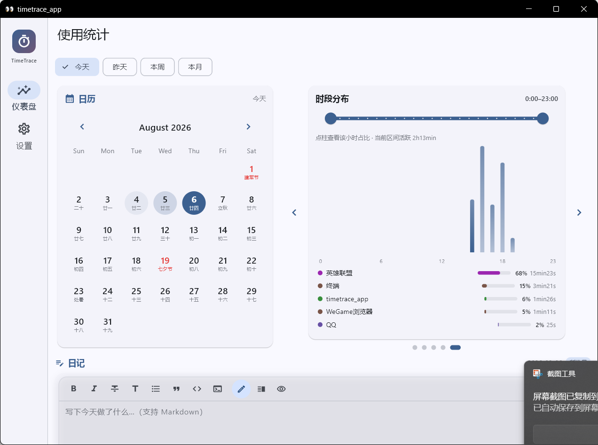
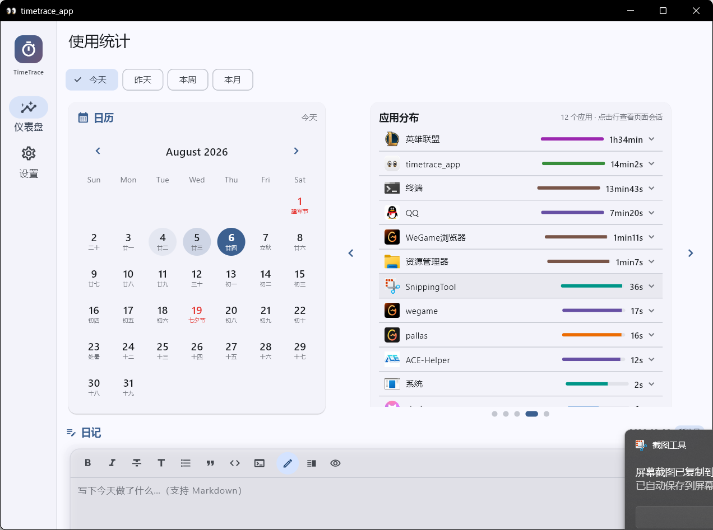
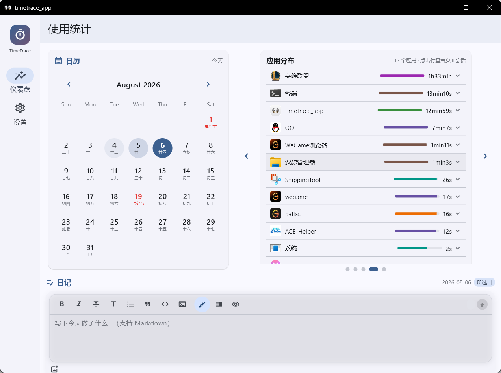
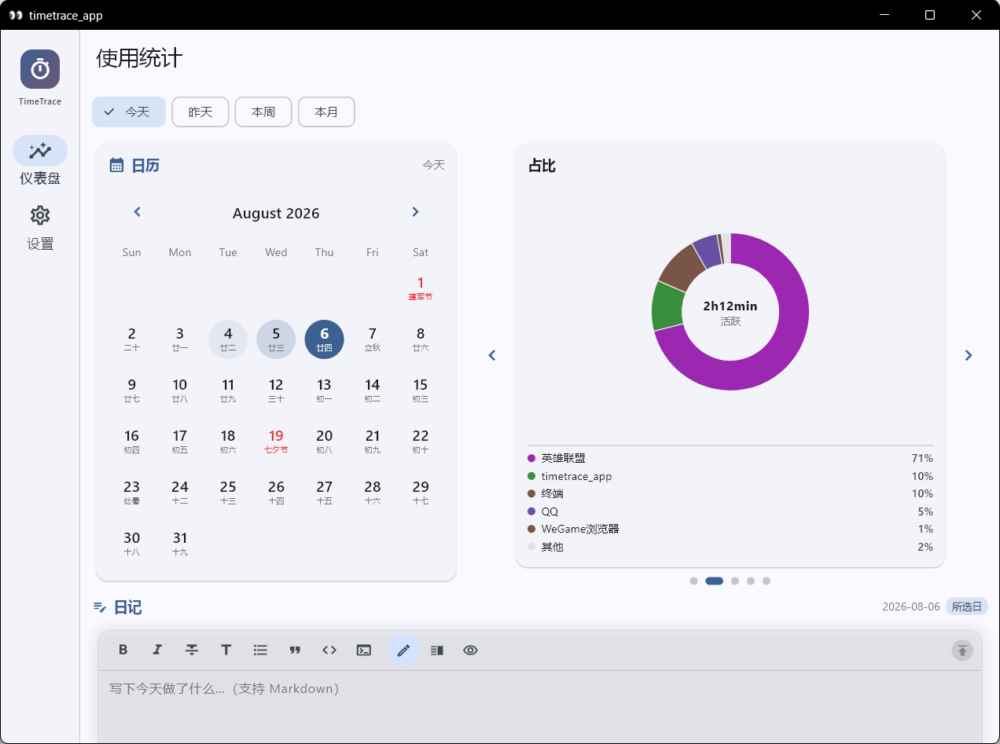
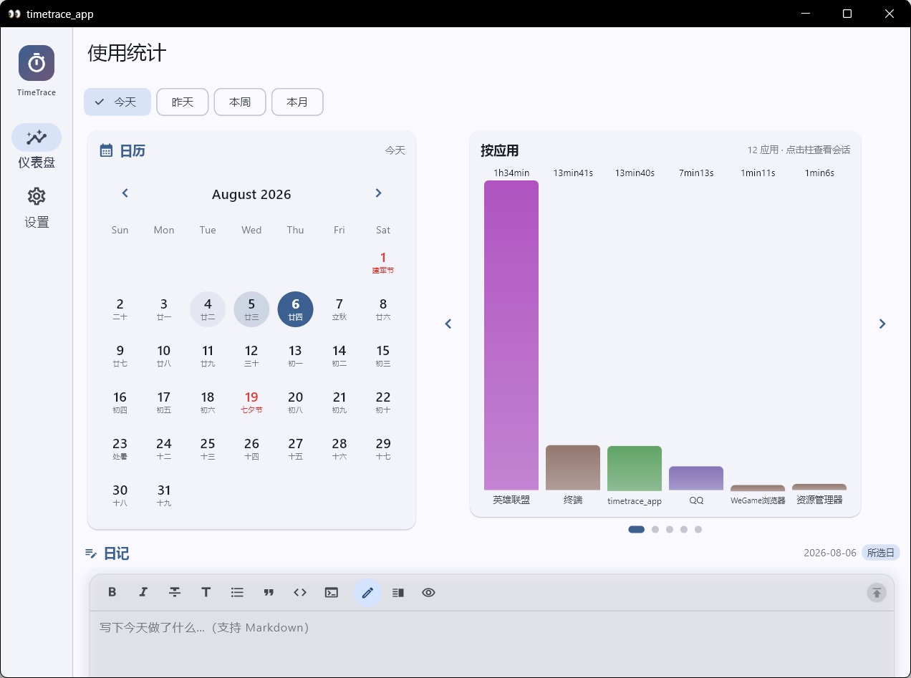
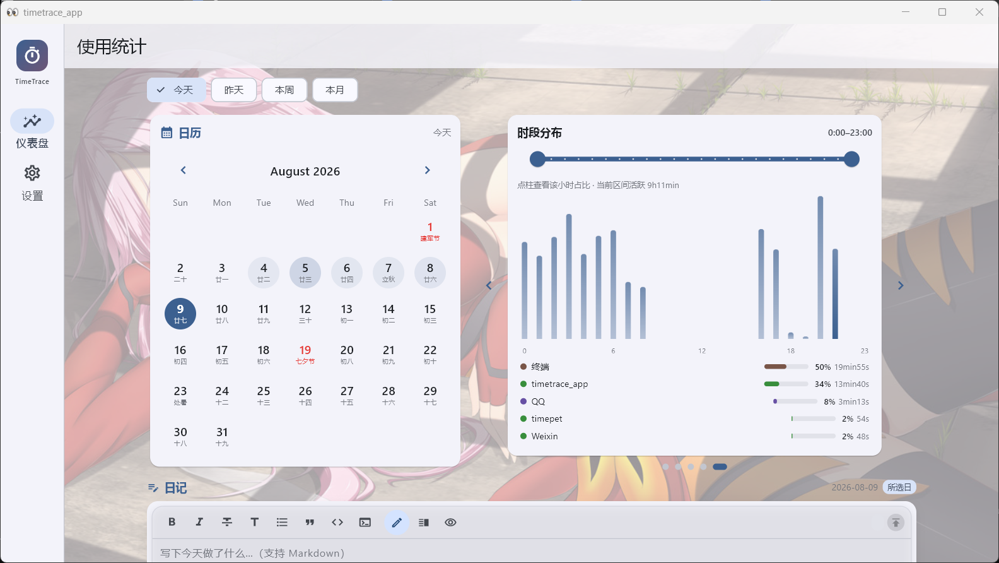
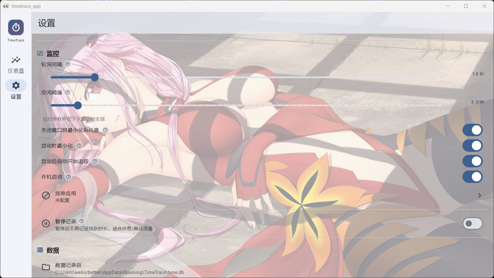

<p align="center">
  
</p>

<h1 align="center">TimeTrace</h1>

<p align="center">
  本地优先的 Windows 使用统计 + 日记应用
  <br>
  <b>Rust</b> 核心 + <b>Flutter</b> UI · 100% 本地运行，无网络、无遥测
</p>

<p align="center">
  <a href="README_EN.md">English</a>
  ·
  <a href="https://github.com/wellorbetter/timetrace/releases">
    
  </a>
  ·
  
</p>

---

## 功能特性

- **使用统计** — 自动记录前台应用活跃时长；自动识别空闲、锁屏与睡眠，不计入活跃时间
- **应用图标** — 实时识别前台应用与图标；系统托盘常驻，右键菜单快速控制
- **数据仪表盘** — 柱状图 / 饼图 / 24h 时段分布 / 当日汇总 / 应用分布轮播，与日历联动
- **日记** — 朋友圈式日记：Markdown 编辑、图片相册、草稿自动保存、按天分组折叠
- **设置** — 监控参数、排除应用、开机启动、启动最小化、主题/字体/背景与仪表盘顺序均可配置并持久化
- **背景与应用选择** — 支持本地背景图、透明度调节、运行中进程筛选和应用图标展示

## 截图

| | |
| --- | --- |
|  |  |
|  |  |
|  | |

## 技术栈

| 模块 | 说明 |
| --- | --- |
| `crates/core` | Rust 核心：Win32 事件钩子监控、空闲/睡眠检测、SQLite 存储 |
| `bridge` | flutter_rust_bridge 跨语言绑定 |
| `app/` | Flutter UI：Riverpod 3 + Material 3，Windows 桌面 |

## 构建

### 环境要求

- Windows 10/11
- [Flutter SDK](https://docs.flutter.dev/get-started/install/windows)（stable 渠道）
- [Rust 工具链](https://rustup.rs/)（`cargo` 需在 PATH 中，构建时自动编译 Rust 桥接库）
- Visual Studio 2022（含「使用 C++ 的桌面开发」工作负载）

### 命令

```bash
# 1) Rust workspace 测试
cargo test --workspace

# 2) Flutter 静态分析
cd app && flutter analyze --no-fatal-infos

# 3) Windows Release 构建（自动编译并拷贝 timetrace_bridge.dll）
cd app && flutter build windows --release
# 产物：app/build/windows/x64/runner/Release/

# 4) Flutter 测试
cd app && flutter test
```

## 下载

- 最新版本：<https://github.com/wellorbetter/timetrace/releases>
- 下载 `TimeTrace-vX.Y.Z-windows-x64.zip`，解压后直接运行 `timetrace_app.exe`，无需安装。

## 开发过程

全程 vibe coding：前期用 DeepSeek V4 Flash + Pi 快速搭出原型，后期切换到 Codex 持续做性能与交互优化。

## 隐私

所有数据只保存在本地 SQLite（`%APPDATA%\TimeTrace\time.db`），不上传任何内容。

## 背景与设置界面

支持本地背景图片、透明度调节，以及带背景效果的仪表盘和设置页：





## License

[MIT](LICENSE)
