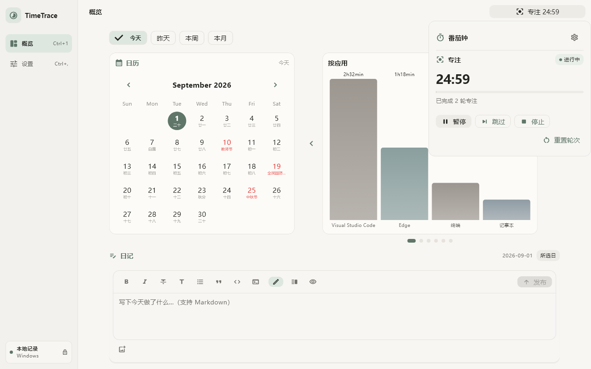

<p align="center">
  
</p>

<h1 align="center">TimeTrace</h1>

<p align="center">
  本地优先的桌面使用追踪、专注提醒与日记应用
  <br>
  <b>Rust</b> 核心 + <b>Flutter</b> UI · 默认离线 · AI 可选开启
</p>

<p align="center">
  <a href="README_EN.md">English</a>
  ·
  <a href="https://github.com/wellorbetter/timetrace/releases">
    
  </a>
  ·
  
  ·
  <a href="LICENSE"></a>
</p>


TimeTrace 自动记录前台应用与活跃时长，把日历、图表、专注提醒、应用明细和日记放在一个桌面工作区里。记录默认只保存在你的电脑上；系统提醒和 AI 日记均由你明确开启。

<p align="center">
  <a href="#下载">下载</a> ·
  <a href="#界面导览">界面导览</a> ·
  <a href="#ai-日记与隐私边界">AI 与隐私</a> ·
  <a href="#从源码构建">源码构建</a>
</p>

## 下载

前往 [GitHub Releases](https://github.com/wellorbetter/timetrace/releases/latest) 下载最新版本。

| 平台 | 状态 | 使用方式 |
| --- | --- | --- |
| Windows 10/11 x64 | 稳定支持 | 下载 `TimeTrace-vX.Y.Z-windows-x64.zip`，完整解压后运行 `timetrace_app.exe` |
| macOS | 自用预览 | 下载 `TimeTrace-vX.Y.Z-macos.zip`，解压后运行 `Install TimeTrace.command`；当前未经过 Apple notarization |

## 功能

- **自动追踪** — 记录前台应用、窗口标题和活跃时长；识别空闲、锁屏与睡眠，避免把离开时间算作使用时间
- **日历与概览** — 柱状图、饼图、24 小时时段分布、当日汇总、应用排行和历史明细与日历联动
- **专注与使用提醒（可选）** — 内置番茄钟；可为指定应用设置严格连续前台使用阈值、冷却时间和重复策略
- **本地日记** — Markdown 编辑、图片相册、草稿保存、按日期整理，并与当天的真实使用记录放在一起
- **AI 日记（可选）** — 支持 DeepSeek 与 OpenAI-compatible Chat Completions；可自定义模型、Endpoint、写作要求与每日生成时间
- **桌面体验** — 系统托盘、开机启动、启动最小化、排除应用、浅色/深色主题、字体、背景和概览布局均可配置
- **数据控制** — 自定义数据库目录，导出 CSV，随时暂停记录或清除全部本地数据

## 界面导览

### 一个日历，六种使用视图

选中日期后，右侧轮播会同步切换应用柱状图（页首主图）、使用占比、当日汇总、应用明细、24 小时时段分布和使用历史；不需要在多个页面之间来回跳转。每个视图都可以在设置中隐藏或排序。

| 使用占比 | 当日汇总 |
| --- | --- |
|  |  |
| 应用明细 | 24 小时时段分布 |
|  |  |

### 专注计时随手可达，连续使用提醒在后台工作

顶栏右侧会持续显示番茄钟的当前阶段与剩余时间，点击即可打开轻量控制面板，开始、暂停、继续、跳过、停止或重置而不离开当前页面。应用提醒则只在后台累计同一可执行程序持续位于前台的有效时间；切换应用、空闲、锁屏、睡眠或暂停追踪都会结束连续使用段，恢复后不会补算离开时间。



默认番茄节奏是 **25 分钟专注 / 5 分钟短休息 / 15 分钟长休息**，每完成 4 轮专注进入长休息；下一阶段不会自动开始。应用提醒的新规则默认在连续使用 60 分钟时提醒，重复提醒冷却 30 分钟，这些数值都可以单独修改。

使用方法：

1. 打开 **设置 → 专注与使用提醒 → 番茄钟**，启用番茄钟并按需要调整阶段时长、自动开始、通知和声音。
2. 如需应用提醒，在同一区域启用 **应用连续使用提醒**，再到 **应用提醒规则** 选择“添加”，从当前运行的应用中选择目标，然后设置阈值、冷却时间和是否重复提醒。
3. 使用窗口右上角的番茄钟状态入口打开快速控制面板；主窗口隐藏后，也可以从系统托盘查看倒计时并执行常用操作。

两项能力可以分别开启。第一次明确启用通知或点击“测试通知”时，TimeTrace 才会请求系统通知权限；拒绝或投递失败会在设置页显示状态，不会反复弹出授权请求。

### 使用事实旁边，就是当天的日记

概览向下滚动即可写 Markdown 日记、添加图片，或让 AI 根据当天的真实使用事实生成一篇可编辑的日记；AI 内容会标记模型来源，不会冒充手写内容。


### 从外观到概览顺序都由你决定

| 主题、字体、背景与透明度 | 轮播模块开关与排序 |
| --- | --- |
|  |  |

### AI 不是黑盒开关

模型 Endpoint、模型名、API Key 环境变量、写作语气、是否反思、是否给建议、是否参考既有日记，以及手动/定时生成都可以独立控制。

| 模型服务与连接检查 | 写作要求与生成方式 |
| --- | --- |
|  |  |

### 后台记录与数据仍在你手里

| 轮询、空闲阈值、托盘与开机启动 | 数据目录、导出与清除 |
| --- | --- |
|  |  |

## AI 日记与隐私边界

AI 日记默认关闭。关闭时不会连接模型服务，也不会发送使用记录或日记正文。

开启并生成时，TimeTrace 会把所选日期的必要使用事实发送到你配置的模型 Endpoint，包括聚合活跃/空闲时长、会话数量、切换次数、峰值时段、主要应用和有限的使用历史。窗口标题、文件路径和原始事件不会进入 AI 请求；已有日记正文默认也不发送，只有你单独开启“允许参考已有日记”后才会包含。

API Key 由你指定的系统环境变量提供，TimeTrace 只保存环境变量名，不保存密钥内容。连接测试只验证模型服务，不发送 TimeTrace 数据。使用第三方模型服务时，仍需遵守该服务商的隐私政策和计费规则。

## 提醒与隐私边界

番茄钟和应用连续使用提醒彼此独立，升级后都保持关闭，不会在启动时申请通知权限或弹出测试通知。只有你启用相应功能或点击“测试通知”后，TimeTrace 才会初始化桌面通知；通知遵循系统勿扰模式。

应用规则只保存在本地 SQLite，以规范化可执行文件路径作为稳定匹配身份。顶栏番茄钟、托盘、规则列表和系统通知都不会显示规则路径或窗口标题：超时通知只包含应用显示名和取整后的连续使用分钟数。正常的一秒计时不会写数据库，重启后番茄钟与当前连续使用段都会安全回到未运行状态。

## 本地数据

TimeTrace 的 SQLite 数据库可能包含应用名称、可执行文件路径、窗口标题、使用会话以及你写入的日记。默认位置：

- Windows：`%APPDATA%\TimeTrace\time.db`
- macOS：`~/Library/Application Support/TimeTrace/time.db`

这些本地数据不会因为安装或启动 TimeTrace 自动上传。应用提醒规则与历史使用记录拥有独立生命周期，清除使用记录不会意外删除规则。请把数据库和日记图片视为私人数据并妥善备份。

## 从源码构建

### Windows

环境：Flutter stable、Rust stable、Visual Studio 2022（含“使用 C++ 的桌面开发”）。

```powershell
cargo test --workspace
cd app
flutter pub get
flutter analyze --no-fatal-infos
flutter test
flutter build windows --release
```

### macOS

环境：Flutter stable、Rust stable、Xcode Command Line Tools。

```bash
cargo test -p timetrace-core -p timetrace-bridge
chmod +x scripts/build_macos.sh
./scripts/build_macos.sh
```

## 架构

| 模块 | 说明 |
| --- | --- |
| `crates/core` | 跨平台追踪、空闲检测、会话聚合与 SQLite 存储 |
| `bridge` | `flutter_rust_bridge` 跨语言绑定 |
| `app/` | Flutter 桌面 UI（Riverpod + Material 3） |

## License

[MIT](LICENSE)
