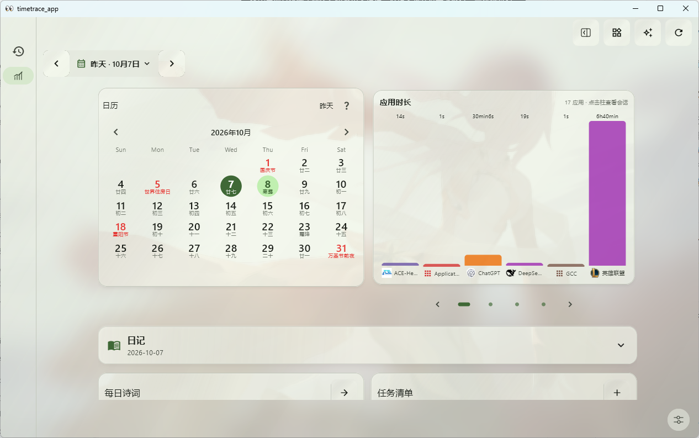
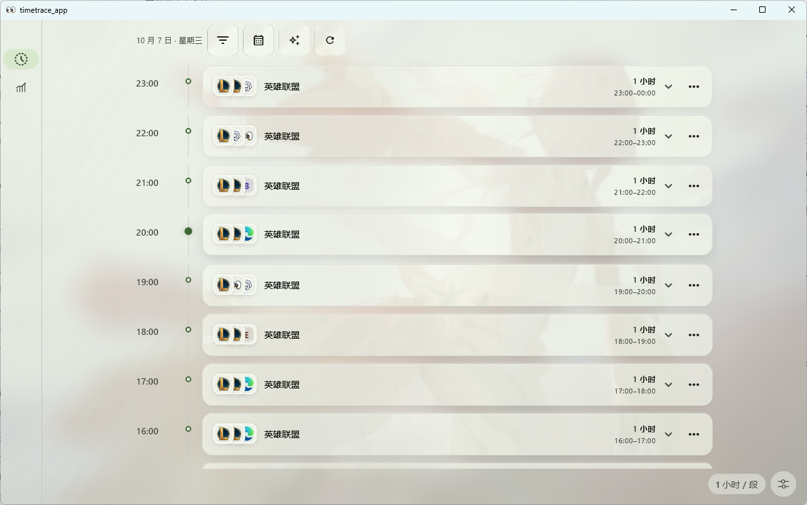
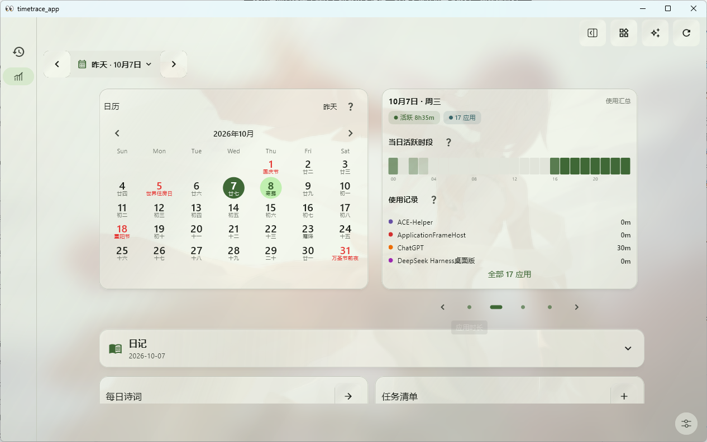
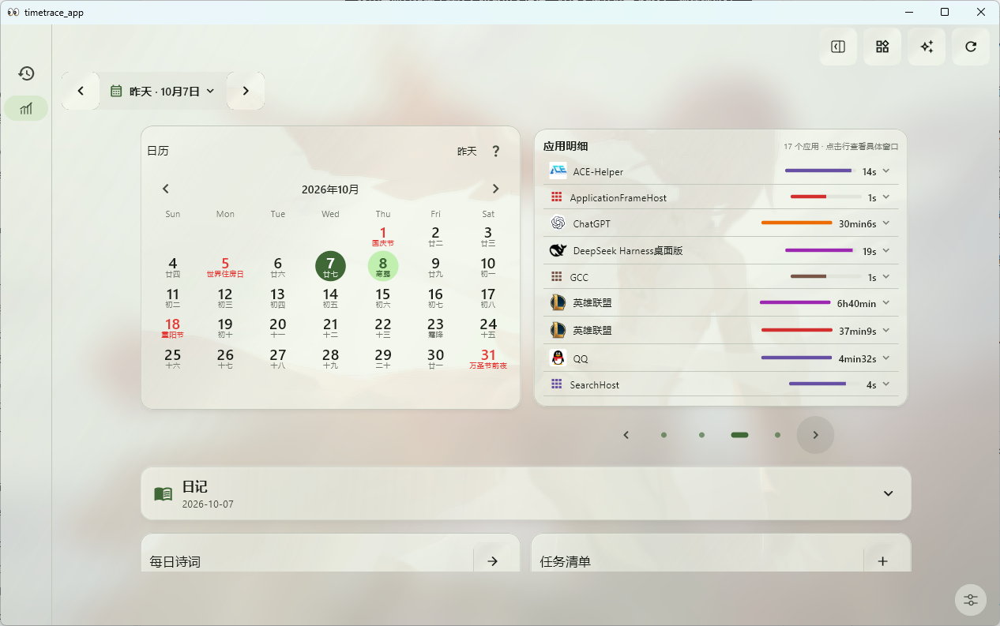
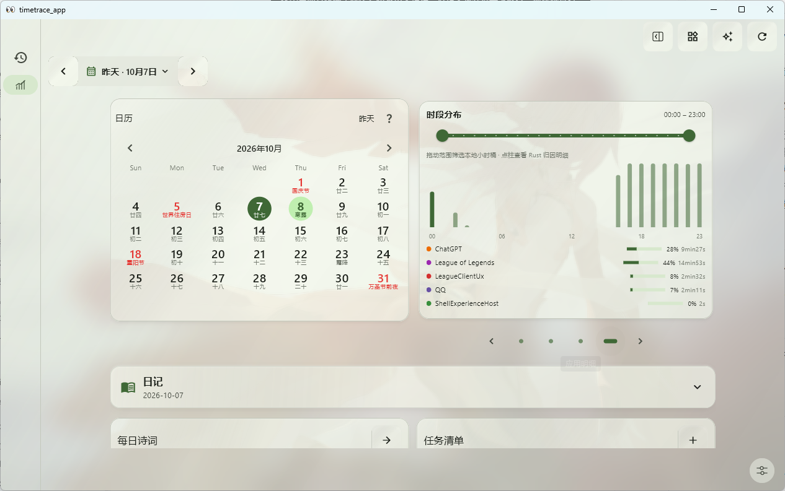
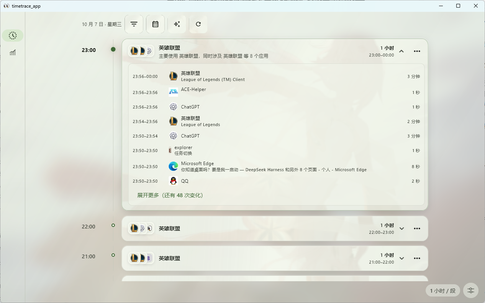
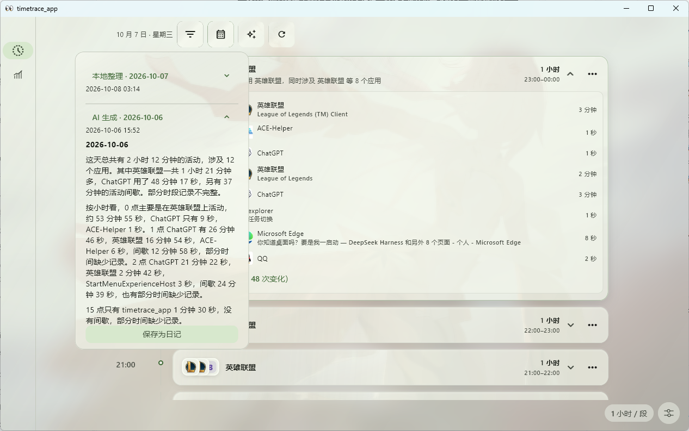
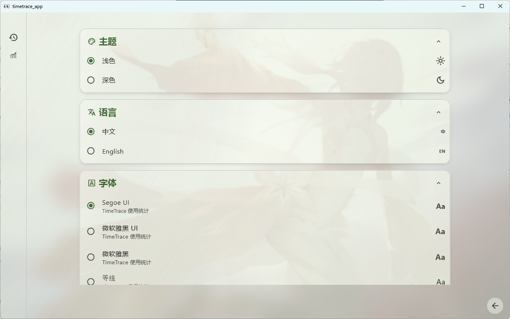

<p align="center"></p>

# TimeTrace

一款开源的电脑使用统计与日记工具。看看每天、每周、每月把时间花在哪些软件上，也可以查某个小时的使用情况，比如这一小时打了多久 LOL、浏览器用了多久。

Rust 核心 + Flutter 桌面界面，基础记录保存在本地，AI 总结可选。

[English](README_EN.md) · [下载预览版](https://github.com/wellorbetter/timetrace/releases/tag/v1.2.0-preview.1) · [所有版本](https://github.com/wellorbetter/timetrace/releases) · [反馈问题](https://github.com/wellorbetter/timetrace/issues)



## v1.2 这次改了什么

这次主要重新整理了界面和工作台：把日历、数据轮播和日记放在一起，组件可以按自己的习惯调整；新增时间流，按时段回看应用使用记录。任务清单、番茄钟、倒计时和每日诗词也放进了组件里，计时记录通过小弹窗查看。背景、主题、材质和设置入口也做了调整。

目前是 **Windows 预览版**，还有一些 UI 细节和文件夹打开问题，预计后续修复，欢迎反馈。

## 可以用来做什么

- **看使用情况**：小时、日、周、月和自定义范围；柱状图、饼图、应用明细与时段分布。
- **按时间回看**：从时间流查看用了哪些应用、用了多久，再展开具体记录。
- **记录一天**：本地 Markdown 日记、图片，以及可选的 AI 总结。
- **摆自己的工作台**：调整组件布局，使用任务清单、番茄钟、倒计时和每日诗词。
- **调整桌面体验**：背景、主题、字体、材质、托盘、开机启动和排除应用等设置。

## 界面

### 时间流：按时段回看软件使用



### 数据视图：时长、汇总、应用明细与时段分布







### 展开时间段，查看具体使用记录



### AI 总结：根据使用记录整理一天



### 外观设置：主题、语言和字体



以上截图由作者选定，用于展示当前 Windows 界面。截图背景由作者自行选择，不是安装包的默认背景。

## 下载与使用

下载 [v1.2.0-preview.1](https://github.com/wellorbetter/timetrace/releases/tag/v1.2.0-preview.1) 的 `TimeTrace-v1.2.0-preview.1-windows-x64.zip`，完整解压后运行 `Release/timetrace_app.exe`。适用于 Windows 10 / 11 x64。

更新前退出旧版并备份自己的记录，不要同时运行多份记录进程。

这次没有新的 macOS 包；历史版本的 macOS 包不代表本次界面已验证。

## 隐私与 AI

基础活动记录和日记保存在本地，不需要注册账号。启用并触发 AI 总结时，必要内容会发送到自己配置的模型服务，遵循该服务的隐私与计费规则。不配置 AI 也可以使用统计和本地日记。诗词可能访问公共接口，因此不是“完全不联网”的应用。

数据库、日记图片、应用路径和窗口标题可能包含私人信息，请自行备份，反馈问题时不要上传 Key 或私人记录。

## 源码与构建

本版从早期基线重新整理，当前界面已合入 main。[v1.2.0-preview.1 标签](https://github.com/wellorbetter/timetrace/tree/v1.2.0-preview.1)保留发布包对应的源码；需要复现该包时，请使用该标签。发布分支保留对应源码与说明。

Windows 构建需要 Flutter、Rust 和 Visual Studio 的“使用 C++ 的桌面开发”工具链。常规入口：

```powershell
git switch --detach v1.2.0-preview.1
cd app
flutter pub get
flutter build windows --release --no-tree-shake-icons
```

| 模块 | 职责 |
| --- | --- |
| `crates/core` | 应用监控、时间记录与 SQLite 存储 |
| `bridge` | Rust / Flutter 跨语言绑定 |
| `app` | Flutter 桌面界面 |

## 开发与许可

前期使用 DeepSeek + Pi 搭出原型，后续通过 Codex 持续调整界面与交互。欢迎提 issue，也欢迎 Star。

[MIT](LICENSE)。第三方组件保留各自许可；截图中的个人背景不作为可再分发的默认素材。
