<p align="center">
  
</p>

<h1 align="center">TimeTrace</h1>

<p align="center">
  A local-first desktop activity tracker, focus reminder, and journal
  <br>
  <b>Rust</b> core + <b>Flutter</b> UI · Offline by default · Optional AI
</p>

<p align="center">
  <a href="README.md">中文</a>
  ·
  <a href="https://github.com/wellorbetter/timetrace/releases">
    
  </a>
  ·
  
  ·
  <a href="LICENSE"></a>
</p>

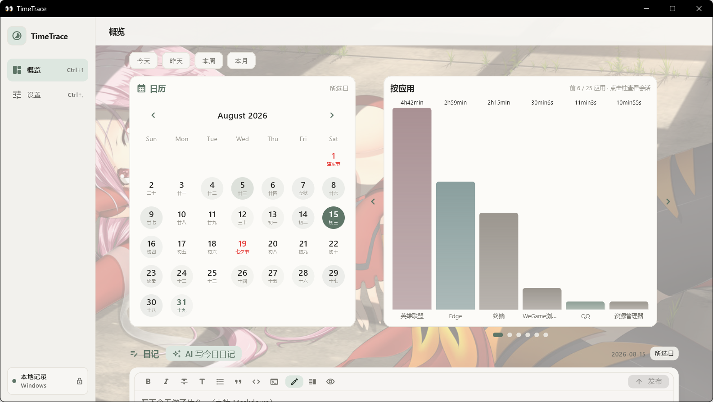

TimeTrace automatically records foreground applications and active time, then brings the calendar, charts, focus reminders, app details, and journal into one desktop workspace. Records stay on your computer by default; desktop reminders and AI journaling are explicit opt-ins.

<p align="center">
  <a href="#download">Download</a> ·
  <a href="#interface-tour">Interface tour</a> ·
  <a href="#ai-journal-and-privacy-boundary">AI &amp; privacy</a> ·
  <a href="#build-from-source">Build</a>
</p>

## Download

Get the latest build from [GitHub Releases](https://github.com/wellorbetter/timetrace/releases/latest).

| Platform | Status | How to run |
| --- | --- | --- |
| Windows 10/11 x64 | Stable | Download `TimeTrace-vX.Y.Z-windows-x64.zip`, extract the complete folder, and run `timetrace_app.exe` |
| macOS | Self-use preview | Download `TimeTrace-vX.Y.Z-macos.zip`, extract it, and run `Install TimeTrace.command`; the app is not Apple-notarized yet |

## Features

- **Automatic tracking** — records foreground apps, window titles, and active time while excluding idle, locked, and suspended periods
- **Calendar and overview** — calendar-linked bar, donut, hourly, daily summary, app ranking, and history views
- **Focus and usage reminders (optional)** — a Pomodoro timer plus strict continuous-foreground thresholds, cooldowns, and repeat policies for selected applications
- **Local journal** — Markdown editing, image albums, draft persistence, and date-based organization beside the day's activity facts
- **AI journal (optional)** — works with DeepSeek and OpenAI-compatible Chat Completions endpoints, with configurable models, writing preferences, and a daily schedule
- **Desktop experience** — system tray, startup/minimize behavior, excluded apps, light/dark themes, fonts, backgrounds, and overview layout controls
- **Data control** — choose the database folder, export CSV, pause tracking, or delete all local data

## Interface tour

### One calendar, seven synchronized views

Select a date and the right-hand carousel stays in sync across application bars, usage share, daily summary, focus and reminders, application details, 24-hour distribution, and usage history. Every view can be hidden or reordered in Settings.

| Usage share | Daily summary |
| --- | --- |
| 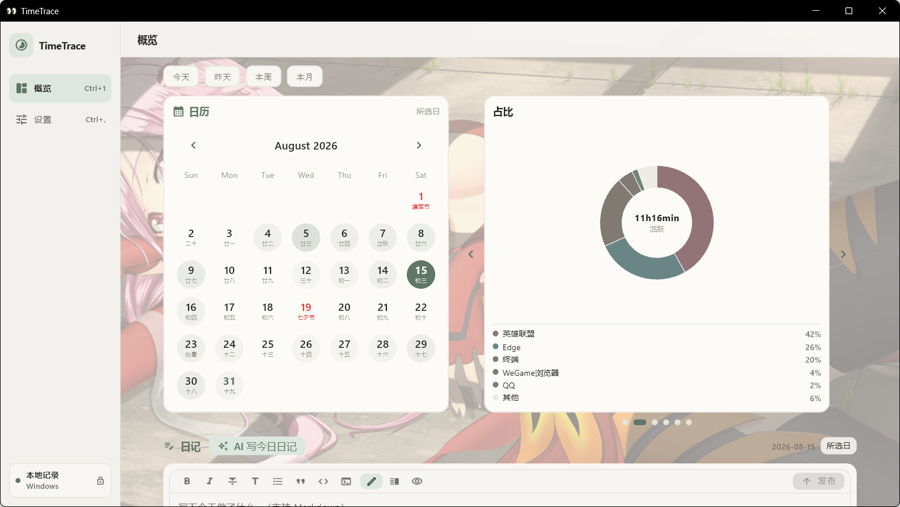 | 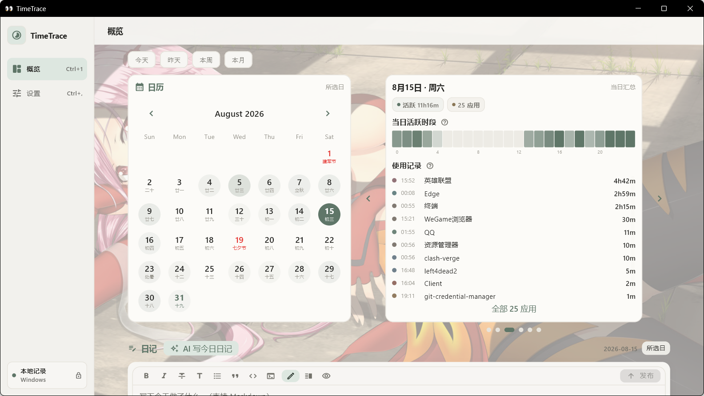 |
| Application details | 24-hour distribution |
| 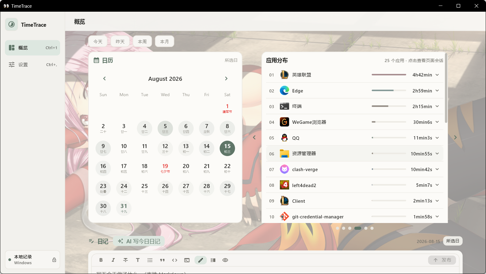 | 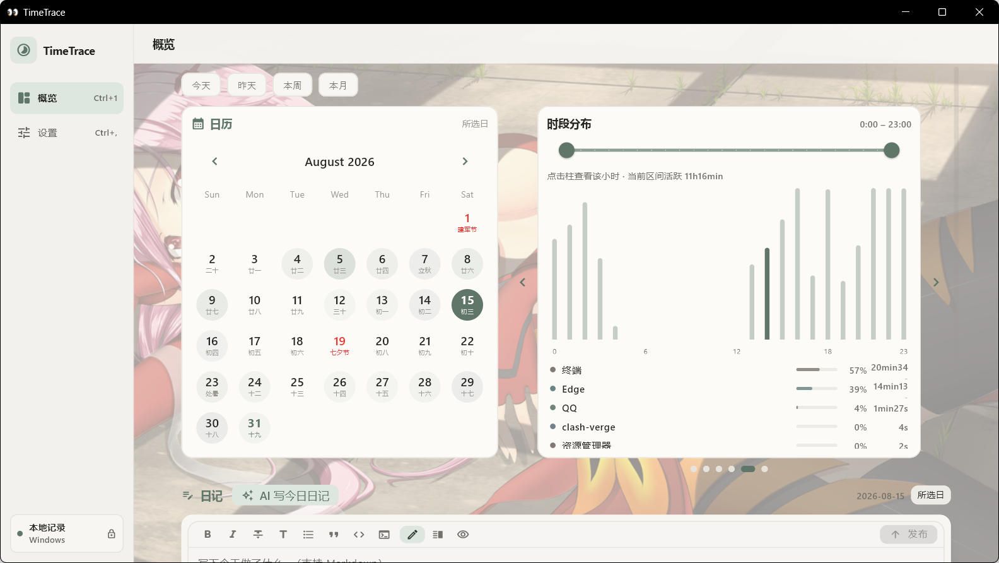 |

### Focus timing and continuous-use reminders share one card

The Pomodoro timer supports focus, short break, long break, pause, resume, skip, and stop. Application reminders count only a strict uninterrupted foreground segment for the same executable. Switching apps, becoming idle, locking, sleeping, or pausing tracking ends that segment, and resumed activity never catches up missed time.

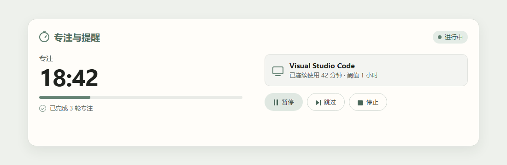

The default rhythm is **25 minutes of focus / 5 minutes of short break / 15 minutes of long break**, with a long break after every 4 completed focus rounds; the next phase does not start automatically. A new application rule defaults to a 60-minute threshold and a 30-minute repeat cooldown. Every value can be changed independently.

To get started:

1. Open **Settings → Focus & usage reminders → Pomodoro**, enable the timer, and adjust phase lengths, automatic start, notifications, and sound as needed.
2. For application reminders, enable **Application continuous-use reminders** in the same area, then choose **Application reminder rules → Add**, select a currently running application, and set its threshold, cooldown, and repeat policy.
3. Return to Overview and use the **Focus reminders** carousel view and its “Focus & reminders” card to start, pause, resume, skip, stop, or reset the timer. After hiding the main window, the system tray still shows the countdown and common controls.

The two capabilities can be enabled independently. TimeTrace requests system notification permission only when you explicitly enable notifications for a reminder or choose “Test notification.” A denial or delivery failure is shown in Settings without repeatedly prompting you.

### The journal lives beside the day's facts

Scroll down from the overview to write Markdown, attach images, or ask AI to draft an editable journal entry from that day's factual activity. Generated entries retain their model provenance instead of pretending to be handwritten.

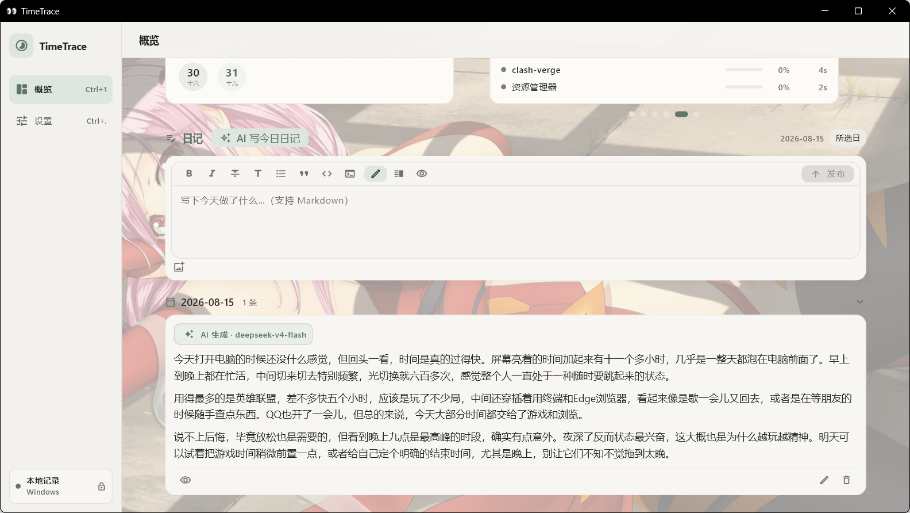

### Make the workspace yours

| Theme, font, background, and opacity | Carousel visibility and ordering |
| --- | --- |
| 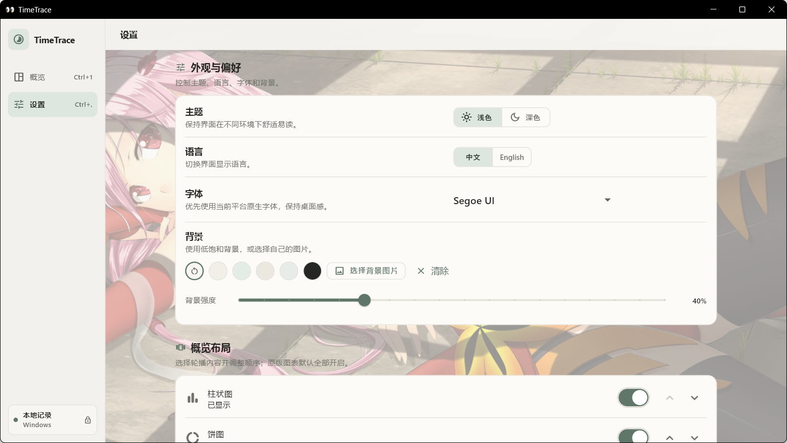 | 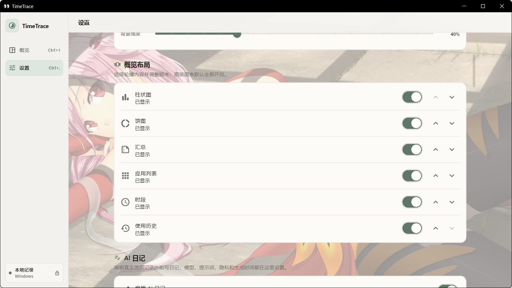 |

### AI is configurable, not a black box

Control the model endpoint, model name, API-key environment variable, writing voice, reflection and suggestion rules, access to existing journals, and manual or scheduled generation independently.

| Model service and connection check | Writing and generation controls |
| --- | --- |
| 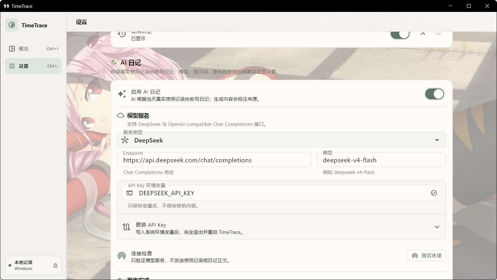 | 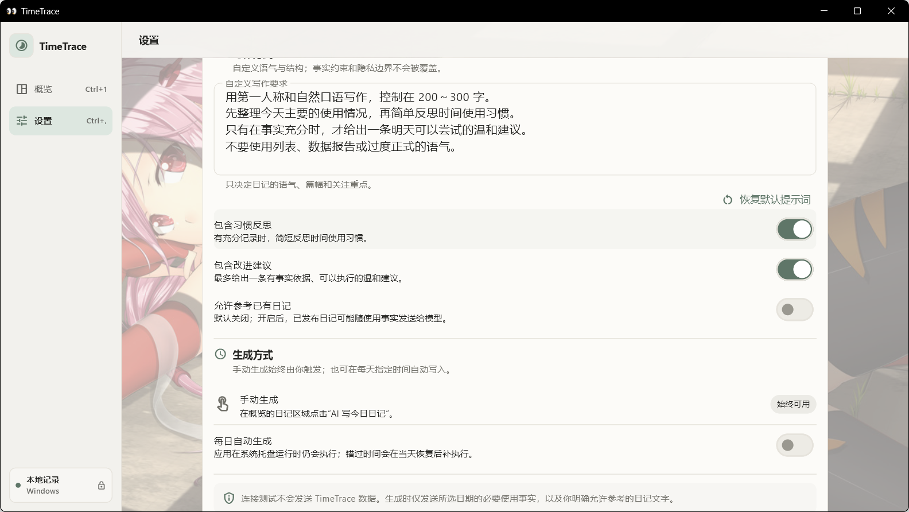 |

### Background behavior and data remain under your control

| Polling, idle threshold, tray, and startup | Data folder, export, and deletion |
| --- | --- |
| 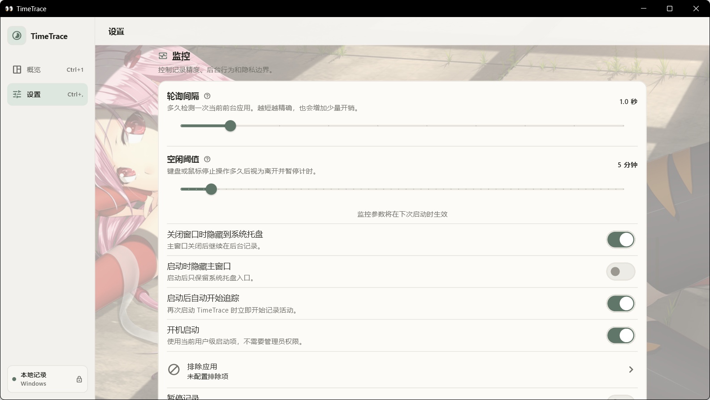 | 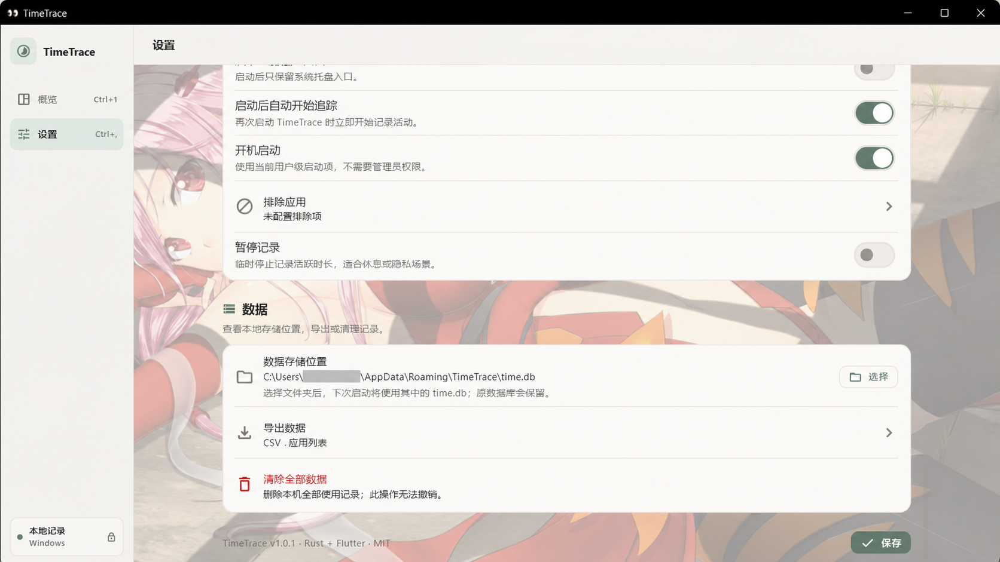 |

## AI journal and privacy boundary

AI journaling is off by default. While it is off, TimeTrace does not contact a model service or send usage records or journal text.

When you opt in and generate an entry, TimeTrace sends the configured endpoint only the selected day's necessary usage facts: aggregate active/idle time, session and context-switch counts, peak time, top applications, and a bounded usage history. Window titles, file paths, and raw events are excluded. Existing journal text is also excluded unless you separately enable “Allow existing journal entries.”

The API key comes from a system environment variable that you name; TimeTrace stores the variable name, not the key. The connection test sends no TimeTrace data. Your configured model provider's privacy policy and pricing still apply.

## Reminder privacy boundary

Pomodoro and application continuous-use reminders are independent and remain off after an upgrade. TimeTrace does not request notification permission or show a test notification at startup. The desktop notification adapter initializes only after you enable a reminder or explicitly select “Test notification,” and it respects the operating system's Do Not Disturb mode.

Application rules stay in local SQLite and use a normalized executable path only as a stable matching identity. The reminder card, rule list, and desktop notifications never render that path or a window title: a timeout notification contains only the application display name and rounded continuous-use minutes. The one-second runtime loop performs no database writes, and both transient timers safely restart in the idle state.

## Local data

The SQLite database can contain application names, executable paths, window titles, usage sessions, and journal entries. Its default location is:

- Windows: `%APPDATA%\TimeTrace\time.db`
- macOS: `~/Library/Application Support/TimeTrace/time.db`

Installing or starting TimeTrace does not automatically upload this local data. Reminder rules have a separate lifecycle from usage history, so clearing tracked usage does not accidentally remove them. Treat the database and journal images as private data and back them up accordingly.

## Build from source

### Windows

Requirements: Flutter stable, Rust stable, and Visual Studio 2022 with Desktop development with C++.

```powershell
cargo test --workspace
cd app
flutter pub get
flutter analyze --no-fatal-infos
flutter test
flutter build windows --release
```

### macOS

Requirements: Flutter stable, Rust stable, and Xcode Command Line Tools.

```bash
cargo test -p timetrace-core -p timetrace-bridge
chmod +x scripts/build_macos.sh
./scripts/build_macos.sh
```

## Architecture

| Module | Description |
| --- | --- |
| `crates/core` | Cross-platform tracking, idle detection, session aggregation, and SQLite storage |
| `bridge` | `flutter_rust_bridge` bindings |
| `app/` | Flutter desktop UI (Riverpod + Material 3) |

## License

[MIT](LICENSE)
