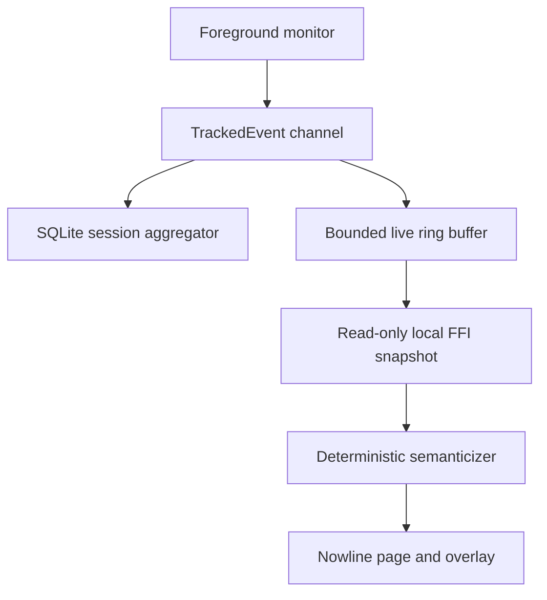

# Nowline

Nowline is TimeTrace's local live-caption surface: recent foreground activity
passes by like restrained lyrics while the current episode stays highlighted.
It is a presentation of the same factual activity stream used by AI Recap, not
a second tracker and not an autonomous agent.

## Data path

The in-memory buffer keeps at most 12 application episodes. Title changes
inside one application update the current episode instead of producing a line
for every tab or document. The Flutter surface polls the small snapshot every
750 ms; it performs no database scan and no network request.

## Privacy contract

| Data | Default | Notes |
| --- | --- | --- |
| Application name | Visible locally | Uses the existing TimeTrace event source |
| Window title | Hidden | Explicit opt-in; known sensitive titles remain redacted |
| Excluded applications | Never shown | Reuses the monitor's existing exclusion boundary |
| Keystrokes / clipboard | Never captured | Not part of the TimeTrace event model |
| AI/model request | Never used for live updates | No waiting agent and no background token spend |
| Network sharing | Not implemented | The `LiveActivityPort` boundary allows a future redacted transport |

Pausing tracking closes the current live episode immediately. The TimeTrace
window itself is filtered from Nowline so the overlay cannot narrate itself.

## Desktop behavior

- The existing TimeTrace window can enter a compact transparent,
  always-on-top mode and later restore its exact size and position.
- The Nowline page rebuilds the latest 12 completed episodes for today from
  SQLite, so its compact scrollback survives an application restart.
- The overlay can be dragged while unlocked.
- Click-through mode sends pointer input to the application beneath it. Use the
  TimeTrace tray/menu-bar item to unlock or return to the main window.
- Placement, line count, opacity, timestamps, title visibility, and the initial
  click-through state are persisted locally in `nowline.json`.

The surface uses `window_manager`, so the Flutter implementation is shared by
Windows and macOS. Platform-specific foreground resolution remains inside the
existing Rust core.

## Deliberate non-goals for this PR

- friend accounts, presence rooms, or a cloud backend
- broadcasting raw history or window titles
- invoking AI for every activity switch
- a second monitor process or duplicate SQLite writer

A later paired mode can implement `LiveActivityPort` with an encrypted,
redacted presence-card transport without changing the timeline UI or weakening
the local default.
